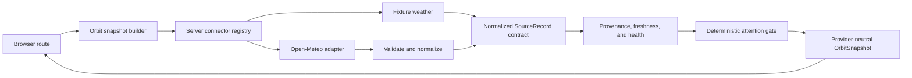
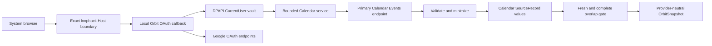
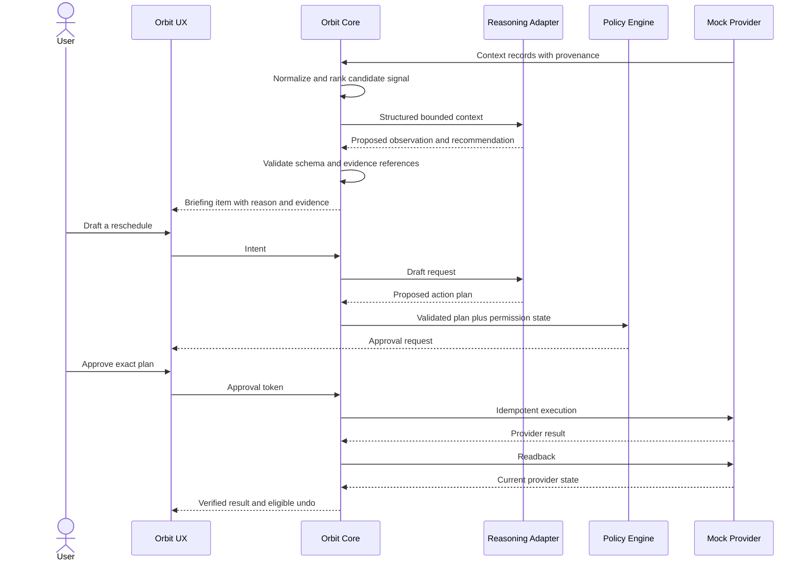

# Orbit Architecture

## Architectural intent

Orbit Core coordinates provider-neutral context, attention, permissions, action state, verification, and audit. Providers supply data, model inference, or execution capabilities through replaceable adapters. Probabilistic output may propose or explain; deterministic systems authorize and change state.

```mermaid
flowchart LR
    P["Context provider adapters"] --> N["Normalization and provenance"]
    N --> G["Personal context graph"]
    G --> A["Attention engine"]
    A --> R["Reasoning provider adapter"]
    R --> V["Schema validation"]
    V --> E["Observations and recommendations"]
    E --> O["Deterministic policy and approval"]
    O --> C["Capability router"]
    C --> X["Execution adapter"]
    X --> K["Provider readback verification"]
    K --> U["Audit and undo metadata"]
```

## Boundaries

### Orbit Core owns

- normalized context and source provenance
- people, household, and relationship rules
- attention scoring inputs and deterministic guardrails
- structured observations, evidence, recommendations, and intents
- capability catalog and permission state
- risk classification and approval policy
- action lifecycle, idempotency, verification, audit, and undo eligibility

### Provider adapters own

- provider authentication and token handling
- translation between provider records and Orbit contracts
- provider capability discovery
- rate-limit, retry, and provider-error translation
- scoped execution and readback

### User experience owns

- onboarding and connection education
- briefings, evidence, follow-up, and corrections
- permission and approval review
- status, verification, history, and undo presentation
- voice input/output and configurable wake-word preferences

## Implemented Stage 2a server boundary

The weather sandbox is the first live context path. Next.js server code selects a fixture or live connector, validates the untrusted provider response, normalizes it, applies freshness and deterministic attention policy, and assembles one serializable `OrbitSnapshot`. Product components never import Open-Meteo response types.

The home route consumes this boundary directly on the server. `GET /api/orbit/snapshot` exposes the same normalized snapshot with `cache-control: no-store` for local inspection and future trusted consumers. Fixture mode is the default and performs no network request. Live mode calls only Open-Meteo for one fixed fictional coarse test point.

This slice has no reasoning-provider call, OAuth, credential store, authentication, background sync, or write path. A stale weather record remains inspectable but cannot create an attention item.

## Local Google Calendar read boundary

Stage 2b extends the same thin gateway with a single authenticated personal
source. The local server owns a one-use PKCE transaction, token exchange,
Windows DPAPI credential vault, bounded Calendar request, response validation,
normalization, cache health, and deterministic overlap policy. The browser sees
only provider-neutral state and records.

A Next.js request proxy rejects every dynamic request whose raw `Host` is not
exactly `127.0.0.1:<bounded-port>`. This closes the browser DNS-rebinding path
created by an otherwise unauthenticated loopback service. Calendar provider I/O
is limited to consent completion and explicit same-origin refresh POSTs; page,
RSC, and snapshot GETs only inspect local state.

Only owned primary-calendar events are authorized. Access tokens live in
memory; the refresh token is encrypted outside the repository for the current
Windows user. The event cache is process-local. Stale or incomplete reads
cannot produce attention. No Calendar write capability is registered, and the
fictional scheduling action remains a distinct demo adapter.

## First action vertical slice

The action demonstration continues to use fictional adapter data. A calendar change and related email create an observation that a meeting conflicts with travel. Orbit recommends rescheduling, drafts a calendar update plus message, requests approval, executes through a mock adapter, verifies the event state, records the audit trail, and offers undo. The Open-Meteo sandbox does not participate in this action path.

## Core components

1. **Connection registry:** adapter instance, user-facing service identity, granted scopes, health, and sync cursor.
2. **Normalization pipeline:** converts source records to typed context events and preserves immutable provenance references.
3. **Context graph:** time-bounded relationships among people, commitments, messages, places, devices, and sources.
4. **Attention engine:** applies deterministic eligibility and safety filters, then ranks candidate concerns using transparent features and optional model assistance.
5. **Reasoning gateway:** sends minimized structured context to a replaceable model adapter and validates returned schemas.
6. **Policy engine:** determines capability availability, risk, required approval, expiry, and prohibited actions.
7. **Capability router:** selects an adapter only after permission and approval checks succeed.
8. **Action coordinator:** enforces immutable plans, idempotency, state transitions, retries, and partial-failure handling.
9. **Verification service:** reads authoritative state from the provider and compares it with the approved expected effect.
10. **Audit service:** records redacted lifecycle events and undo metadata.
11. **Connector registry:** selects the configured server-only context adapter and fails closed on unsupported mode.
12. **Snapshot builder:** combines normalized context, evidence, connection health, and attention bundles into the versioned `OrbitSnapshot` consumed by routes.

## State and trust rules

- Source facts, model inferences, user corrections, and action results are separate record types.
- Model output cannot mutate context, permissions, approval, or execution state directly.
- Every recommendation references evidence IDs and a freshness window.
- Every execution references one unexpired approval for one content-addressed plan.
- Retry uses the same idempotency key and never silently broadens the plan.
- Success means verified provider state, not a successful transport response.
- Undo is a new authorized action, not a database rollback fiction.

## Local Google Nest stream and control boundary

Google Nest extends the connector registry with a separate Device Access OAuth
session, DPAPI vault, cache, token, plan store, stream-session store, and audit.
Product code receives only provider-neutral home structures, rooms, devices,
capabilities, observations, permissions, freshness, completeness, and opaque
references.

Page and snapshot GETs call `peek` and cannot spend provider authority. Explicit
same-origin POST routes perform synchronization, WebRTC session creation/stop,
or plan/approval execution. The browser never selects a Google command string or
provider resource name. Streams are ephemeral and absent from snapshots and
audit payloads. Device commands require fresh complete context, immutable plans,
approval, one execution, readback, verification, and a new approval for undo.

The native Android/iOS Google Home SDK and future Home Assistant adapter remain
replaceable providers behind the same Orbit Core home contracts.

## Deployment posture

No production topology is selected. Weather remains a public evaluation
sandbox. Google Calendar is a local single-Windows-user experiment with a
DPAPI-protected refresh token and process-local normalized cache. Google Nest
adds a separately protected local vault and process-only stream/control state.
Google consent
does not authenticate the Orbit application or isolate multiple people. Hosted
authentication, per-user encrypted storage, durable jobs, retention/export,
provider verification, service levels, and deployment require new decisions.
