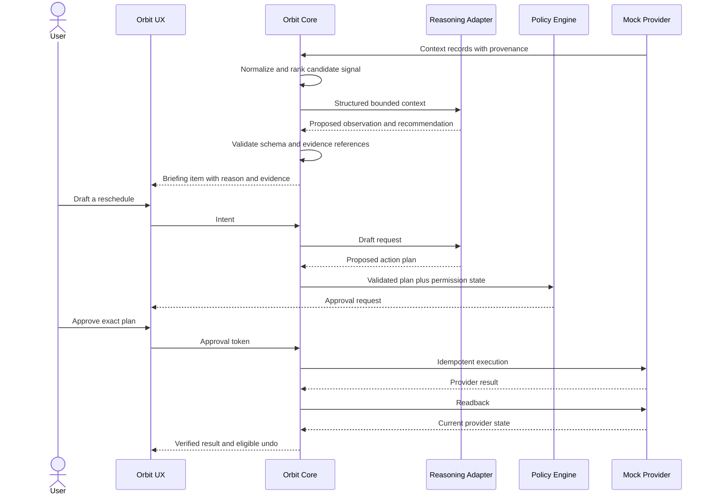

# Orbit Architecture

## Architectural intent

Orbit Core coordinates provider-neutral context, attention, permissions, action state, verification, and audit. Providers supply data, model inference, or execution capabilities through replaceable adapters. Probabilistic output may propose or explain; deterministic systems authorize and change state.

## Boundaries

### Orbit Core owns

- normalized context and source provenance
- people, household, and relationship rules
- attention scoring inputs and deterministic guardrails
- structured observations, evidence, recommendations, and intents
- capability catalog and permission state
- risk classification and approval policy
- action lifecycle, idempotency, verification, audit, and undo eligibility

### Provider adapters own

- provider authentication and token handling
- translation between provider records and Orbit contracts
- provider capability discovery
- rate-limit, retry, and provider-error translation
- scoped execution and readback

### User experience owns

- onboarding and connection education
- briefings, evidence, follow-up, and corrections
- permission and approval review
- status, verification, history, and undo presentation
- voice input/output and configurable wake-word preferences

## First vertical slice

The first slice uses fictional adapter data. A calendar change and related email create an observation that a meeting conflicts with travel. Orbit recommends rescheduling, drafts a calendar update plus message, requests approval, executes through a mock adapter, verifies the event state, records the audit trail, and offers undo.

## Core components

1. **Connection registry:** adapter instance, user-facing service identity, granted scopes, health, and sync cursor.
2. **Normalization pipeline:** converts source records to typed context events and preserves immutable provenance references.
3. **Context graph:** time-bounded relationships among people, commitments, messages, places, devices, and sources.
4. **Attention engine:** applies deterministic eligibility and safety filters, then ranks candidate concerns using transparent features and optional model assistance.
5. **Reasoning gateway:** sends minimized structured context to a replaceable model adapter and validates returned schemas.
6. **Policy engine:** determines capability availability, risk, required approval, expiry, and prohibited actions.
7. **Capability router:** selects an adapter only after permission and approval checks succeed.
8. **Action coordinator:** enforces immutable plans, idempotency, state transitions, retries, and partial-failure handling.
9. **Verification service:** reads authoritative state from the provider and compares it with the approved expected effect.
10. **Audit service:** records redacted lifecycle events and undo metadata.

## State and trust rules

- Source facts, model inferences, user corrections, and action results are separate record types.
- Model output cannot mutate context, permissions, approval, or execution state directly.
- Every recommendation references evidence IDs and a freshness window.
- Every execution references one unexpired approval for one content-addressed plan.
- Retry uses the same idempotency key and never silently broadens the plan.
- Success means verified provider state, not a successful transport response.
- Undo is a new authorized action, not a database rollback fiction.

## Deployment posture

No production topology is selected in discovery. Early implementation should be single-user, local-first where practical, with mocked adapters and a provider-neutral core. Secrets, encryption, retention, and isolation require explicit threat modeling before real integrations.
