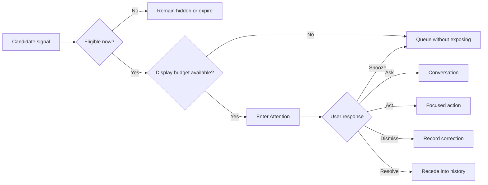

# Orbit Attention Model

## Purpose

The attention model determines whether a concern deserves the daily surface. It is not a feed-ranking system. Its primary job is to keep irrelevant information out.

## Eligibility

A candidate may enter attention only when at least one condition is true:

1. It is currently relevant within a defined time horizon.
2. Delay creates a meaningful cost, risk, or lost opportunity.
3. Orbit needs permission or clarification.
4. An approved action completed, failed, or could not be verified.
5. The user explicitly asked for the information.

Data availability, novelty, model confidence, or cross-domain correlation alone is insufficient.

## Deterministic gates

Before model-assisted ranking, deterministic rules remove candidates that are:

- stale beyond the domain freshness window
- outside granted visibility or purpose
- already resolved, dismissed, or snoozed
- duplicate manifestations of the same concern
- unsupported by accessible evidence
- prohibited by health, household, or safety policy
- lower urgency than an active permission or failure state

## Prioritization

Eligible candidates are compared using urgency, consequence, user commitments, reversibility, confidence, interruption preference, and recent corrections. The model may help summarize and compare candidates, but deterministic policy owns eligibility and interruption limits.

## Implemented weather gate

Stage 2a evaluates normalized fixture or Open-Meteo weather without a model call. Fresh weather may produce at most one read-only candidate, using this deterministic order:

1. apparent temperature at least 100°F;
2. apparent temperature at most 15°F;
3. wind gusts at least 40 mph;
4. precipitation probability at least 70% within the next six hours.

The policy reports the modeled threshold and source evidence. It does not infer a personal plan, health effect, emergency, or action from weather alone. A record is stale when `now >= staleAfter`; stale weather remains inspectable but is excluded before candidate creation.

The fictional travel conflict remains the default focal item so the mocked scheduling journey is stable. `?context=weather` selects the weather bundle only when a fresh weather candidate exists. If live conditions cross no threshold, Orbit stays quiet instead of inventing relevance.

## Implemented Calendar overlap gate

Stage 2b evaluates a complete, fresh, bounded set of normalized primary-calendar
events without a model call. It ignores cancelled, all-day, transparent,
self-declined, invalid, and already-ended events; sorts by start, end, and stable
opaque record ID; and selects the earliest strict overlap. Adjacent events are
not conflicts. At most one `calendar_conflict` item is emitted, with timing and
provenance evidence and `read_only` actionability.

`?context=calendar` selects that concern only when it is eligible. Otherwise
Orbit remains quiet. Calendar context never enters the demo scheduling proposal
or approval state.

## Display budget

- One concern may be visually expanded.
- The existence of additional eligible concerns may be stated in one sentence.
- Additional concerns appear only after “What else?” or equivalent user intent.
- Approval requests and failed or unknown execution states may preempt lower-risk observations.

## Lifecycle

## User control

Users can dismiss, snooze, correct, mute a concern type, change interruption windows, and ask why a concern appeared. These signals inform future prioritization without silently expanding permission.

## Health and household safeguards

Health signals never receive attention merely because a value is unusual; the observation must remain within authorized summarization and must not become diagnosis. Household concerns respect each participant's visibility and cannot be elevated using data the current user cannot inspect.

## Evaluation

Track false-positive attention, time-to-understanding, dismiss/snooze reasons, correction recurrence, missed high-consequence concerns, and whether users can explain why an interruption occurred. Optimize for fewer useful interruptions, not daily engagement volume.
