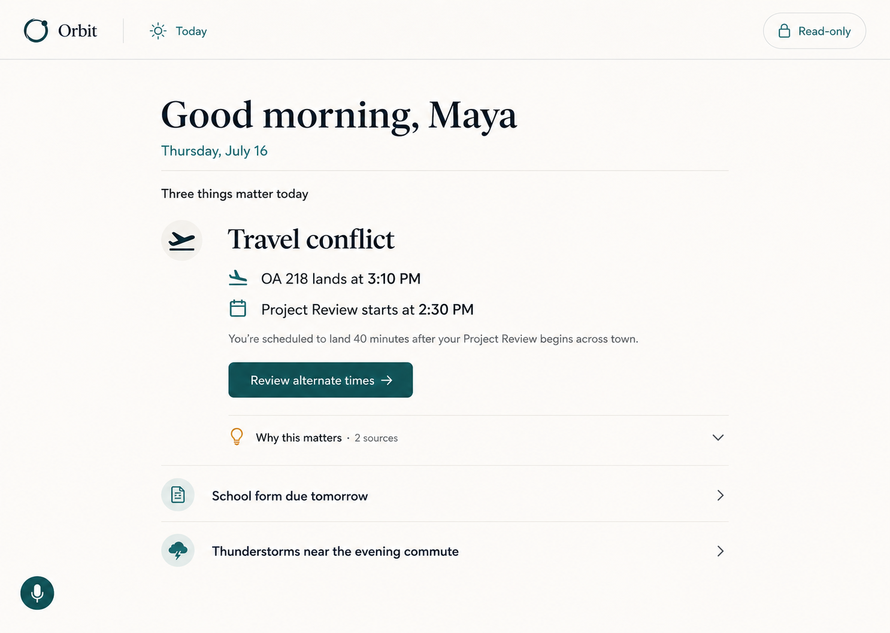
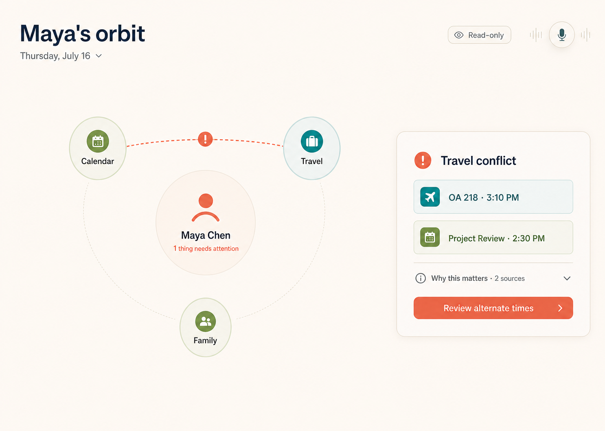
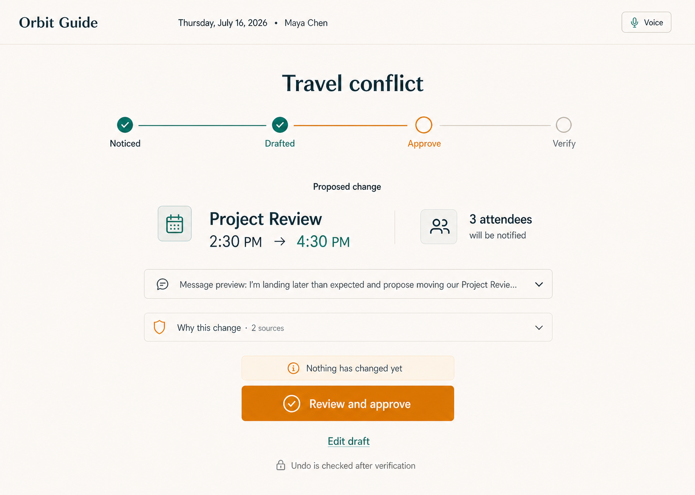

# Frontend Concept Comparison

## Decision

**Recommend Daily Orbit as the primary product direction.** It communicates immediate value fastest, keeps the person focused on three meaningful changes, and makes read-only evidence and the next safe step clear without teaching a new spatial or lifecycle model.

Orbit Guide should inform the later recommendation-detail and action-review flow. Orbit Map should remain a research direction for optional cross-domain exploration rather than the default home screen. This recommendation selects one primary concept; it does not authorize implementation.

## Comparison

Scores use a five-point discovery rubric, where five is strongest.

| Criterion | Daily Orbit | Orbit Map | Orbit Guide |
|---|---:|---:|---:|
| Five-second clarity | 5 | 3 | 4 |
| Daily briefing fit | 5 | 3 | 2 |
| Evidence discoverability | 5 | 4 | 4 |
| Approval comprehension | 3 | 3 | 5 |
| Calmness and cognitive load | 5 | 4 | 5 |
| Structural scalability | 4 | 3 | 4 |
| Responsive potential | 5 | 3 | 4 |
| Distinctive Orbit identity | 4 | 5 | 4 |
| **Total** | **36** | **28** | **32** |

## Daily Orbit

### Strengths

- Makes the “three things that matter” promise concrete.
- Uses strong editorial hierarchy instead of a dashboard grid.
- Separates source facts, Orbit reasoning, freshness, and action.
- Adapts naturally to mobile and spoken summary.
- Provides the clearest read-only home state.

### Risks

- Could become an endless prioritized feed if the three-item constraint erodes.
- Needs a dedicated detail flow for approval, verification, and undo.
- Requires careful ranking and correction behavior to earn continued trust.

### Validation focus

Can users understand why the top item appeared, correct it, and reach a safe draft without mistaking the action for immediate execution?

## Orbit Map

### Strengths

- Expresses the person-centered product metaphor directly.
- Makes cross-domain relationships visible.
- Offers a distinctive context-exploration model beyond chat or dashboards.

### Risks

- Uses more visual interpretation and screen area for the same decision.
- Has the weakest small-screen adaptation.
- Can drift into decorative network complexity as domains grow.
- A literal central portrait may not suit every user's privacy or preference.

### Validation focus

Does the map help users discover a relationship faster than a grouped list, and can it remain legible with realistic domain density?

## Orbit Guide

### Strengths

- Makes the action lifecycle and current decision explicit without showing every internal state.
- Groups the flow into four understandable moments: noticed, drafted, approve, and verify.
- Provides excellent space for exact effects, recipients, evidence, and risk explanation.
- Supports trust repair and partial-failure states.

### Risks

- Still too process-specific for a default daily home screen.
- The compact progress cue needs validation on narrow mobile screens.
- May make low-risk interactions feel bureaucratic if applied universally.

### Validation focus

Can users accurately predict what happens after “Review and approve,” distinguish draft from execution, and understand qualified undo?

## Recommended product composition after selection validation

Daily Orbit should own the home and briefing hierarchy. A later implementation may use Orbit Guide's state clarity inside the selected recommendation flow, but only after testing it as a subordinate pattern. Orbit Map should not be included in the first implementation goal without separate usability evidence.

## Concept review

- Exactly three final PNG concepts exist; each was independently revised after visual review.
- Each uses fictional data anchored to July 16, 2026.
- Each has a distinct information architecture and interaction model.
- No existing UI was available, so an audit was intentionally skipped.
- All concepts preserve read-only or pre-approval state and avoid claiming unverified execution.
- Visible scenario details are illustrative; implementation fixtures must use one internally consistent fictional itinerary.
- Generated images are design targets, not accessible or production-ready interfaces. Typography, contrast, semantics, and responsive behavior require implementation-time validation.
- The final revision removed secondary navigation and evidence density from Daily Orbit, reduced Orbit Map to one active relationship, and compressed Orbit Guide to one decision plus four grouped states.

## Hard stop

No image-to-code, frontend scaffolding, production integration, deployment, or release is included in this phase.
