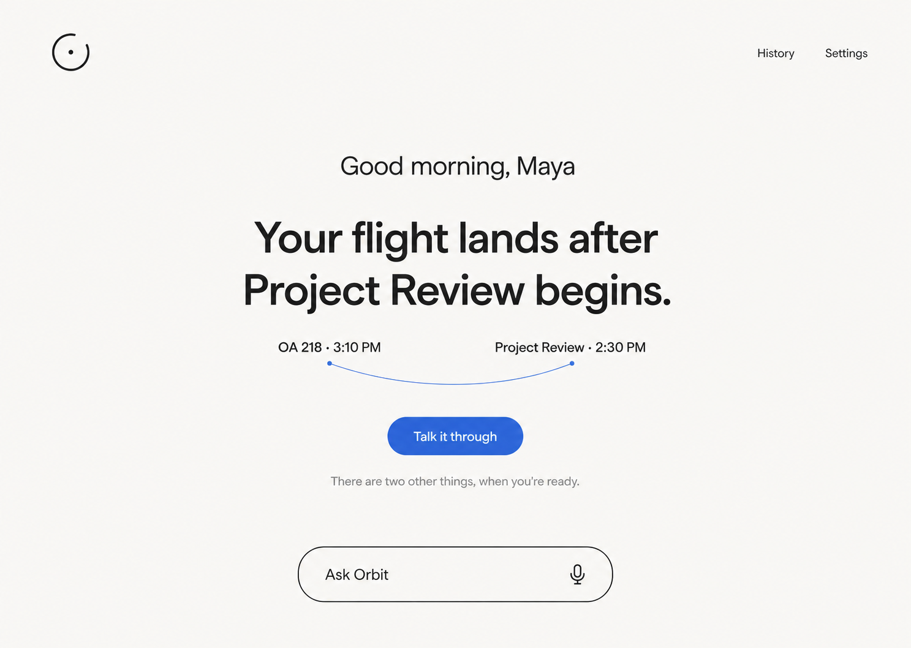
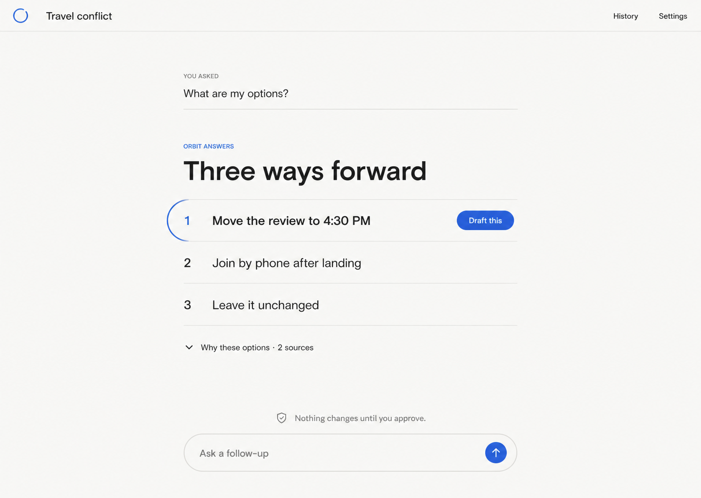
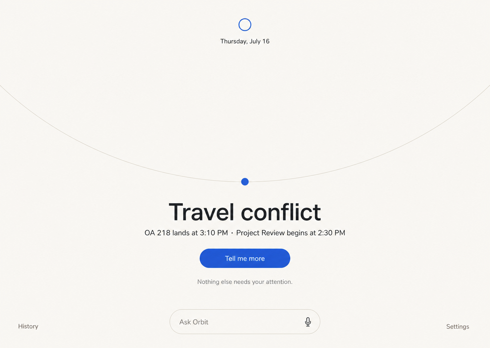

# Revised Concept Comparison

## Approved decision

**Quiet Orbit is the approved primary product direction.** It best expresses the resting and attention states, makes conversation the obvious next step, and proves that Orbit can feel useful without becoming a dashboard.

The centered-person exploration is approved for relevant events and notifications, and Focus is approved as the progressive conversation, evidence, decision, and action behavior within the Quiet Orbit shell. Ambient Orbit remains a useful exploratory reference but is not the implementation target. Frontend implementation was authorized on July 16, 2026; production integrations remain deferred.

## Why the prior direction was retired

The earlier Daily Orbit, Orbit Map, and Orbit Guide concepts remain in `design/concepts/` as historical evidence. They are superseded because they permanently exposed ranked items, domain structure, or lifecycle state. Even after simplification, their page architecture assumed the user should continuously see what Orbit knows.

## Comparison

Scores use a five-point discovery rubric, where five is strongest.

| Criterion | Quiet Orbit | Focus | Ambient Orbit |
|---|---:|---:|---:|
| Calm resting-state fit | 5 | 3 | 5 |
| One-concern clarity | 5 | 5 | 4 |
| Conversation as navigation | 5 | 5 | 4 |
| Progressive disclosure | 4 | 5 | 3 |
| Approval-flow extensibility | 4 | 5 | 3 |
| Orbit identity | 4 | 3 | 5 |
| Mobile adaptability | 5 | 4 | 4 |
| Risk of feeling like a dashboard | 5 | 5 | 5 |
| **Total** | **37** | **35** | **33** |

## Quiet Orbit

### Strengths

- Treats empty space as a trustworthy resting condition.
- One concern enters attention without creating a list or container grid.
- The relationship between two facts is visible without exposing a context graph.
- Conversation input remains primary and secondary concerns remain linguistic, not visual.
- Provides the cleanest foundation for all four states.

### Risks

- Sparse composition must still communicate system health and availability.
- The “two other things” line requires careful prioritization and accessibility behavior.
- Frequent high-priority concerns could make the calm state feel unstable without interruption limits.

### Mobile thinking

Stack the greeting, concern, fact relationship, and action in one centered column. Keep input anchored above the safe area. Replace the curved fact relationship with a short vertical connector when width is limited. History and Settings move behind one quiet utility menu.

## Focus

### Strengths

- Makes conversation visibly replace navigation.
- Reveals bounded options without accumulating a chat transcript.
- Uses text rows and hairlines rather than cards.
- Provides the clearest bridge from question to draft and focused approval.

### Risks

- Works best after a concern is already selected; it is not a complete resting shell by itself.
- Numbered options may feel procedural if used for simple answers.
- Needs careful handling when evidence is uncertain or no safe option exists.

### Mobile thinking

Use a full-height reading column with the user question at the top, options as large touch rows, and the input fixed above the safe area. The selected partial-orbit stroke becomes a short top or left accent without enclosing the row.

## Ambient Orbit

### Strengths

- Expresses “entering Orbit” and receding after resolution with the least chrome.
- Feels visually distinctive without becoming a node graph.
- Makes one relevant signal the only object competing for attention.
- Offers a strong reduced-content resting and listening identity.

### Risks

- The large path may become decorative if motion and state semantics are not precise.
- The composition may feel too empty or mysterious for first-time users.
- Spatial motion requires strong reduced-motion and screen-reader equivalents.

### Mobile thinking

Crop the partial path into a shallow arc above the concern. Keep the signal point, title, action, and input within one thumb-friendly vertical stack. History and Settings move into a single utility menu; reduced-motion mode replaces entry motion with an immediate focus transition.

## Visual review

- Exactly three new independent PNG concepts exist under `design/concepts/refined/`.
- Each uses one focal concern and fictional data anchored to July 16, 2026.
- None uses a dashboard grid, persistent domain navigation, provider logos, or a context graph.
- The concepts are structurally distinct: attention scene, progressive conversational workspace, and ambient signal environment.
- The supplied Apple and Pinterest analyses influenced whitespace, hierarchy, geometry, and accent discipline without direct imitation.
- Images are concept targets, not accessible or production-ready interfaces. Contrast, semantics, focus, input behavior, responsive layout, and reduced motion require implementation-time validation.

## Discovery-phase hard stop

The discovery phase ended before frontend implementation. The approved implementation goal may now build the mocked frontend foundation and Presence Lab, but it must not add production integrations, deployment, or a pull request.
