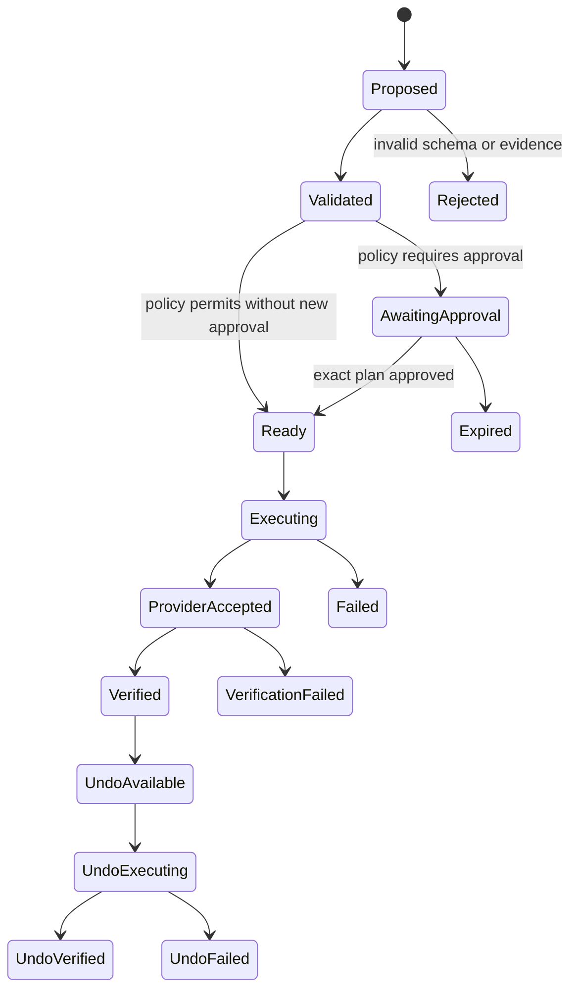

# Orbit Context Model

## Goals

The context model gives Orbit a consistent vocabulary without flattening provenance or inventing certainty. All identifiers are opaque, timestamps are ISO 8601 with timezone, and every externally derived fact retains its source and observed time.

## Core entities

| Entity               | Purpose                                        | Required properties                                                |
| -------------------- | ---------------------------------------------- | ------------------------------------------------------------------ |
| `Person`             | A user or relevant individual                  | `id`, `displayName`, `relationshipScope`                           |
| `Household`          | Explicit shared context boundary               | `id`, `memberIds`, `policyRef`                                     |
| `Relationship`       | Directional relationship with visibility rules | `fromPersonId`, `toPersonId`, `type`, `visibility`                 |
| `SourceRecord`       | Versioned normalized provider record            | `id`, `connectorId`, `externalReference`, `observedAt`, `retrievedAt`, `staleAfter`, `payload` |
| `ContextEvent`       | Normalized fact or change                      | `id`, `domain`, `kind`, `occurredAt`, `sourceRecordIds`, `payload` |
| `Evidence`           | Support for an observation                     | `id`, `sourceRecordIds`, `summary`, `freshness`, `accessScope`     |
| `Observation`        | Validated claim about context                  | `id`, `statement`, `evidenceIds`, `confidence`, `status`           |
| `Recommendation`     | Suggested response to an observation           | `id`, `observationIds`, `rationale`, `capabilityRef`, `status`     |
| `Intent`             | Structured user goal                           | `id`, `actorId`, `goal`, `constraints`, `createdAt`                |
| `Capability`         | Provider-neutral operation                     | `id`, `verb`, `resourceType`, `riskClass`, `adapterRequirements`   |
| `Permission`         | User-granted authority ceiling                 | `subjectId`, `capabilityId`, `scope`, `mode`, `expiresAt`          |
| `ApprovalRequest`    | Reviewable proposed consequence                | `id`, `planHash`, `summary`, `riskClass`, `expiresAt`              |
| `ActionPlan`         | Immutable executable plan                      | `id`, `intentId`, `steps`, `expectedEffects`, `planHash`           |
| `ActionResult`       | Transport and provider response                | `id`, `planId`, `state`, `providerReceipt`, `completedAt`          |
| `VerificationResult` | Readback comparison                            | `id`, `actionResultId`, `expected`, `observed`, `status`           |
| `UndoPlan`           | Qualified compensating action                  | `id`, `actionResultId`, `steps`, `expiresAt`, `limitations`        |
| `AuditEvent`         | Redacted lifecycle event                       | `id`, `actor`, `eventType`, `objectRef`, `occurredAt`, `metadata`  |

## Implemented snapshot contract

Stage 2a introduces a serializable, provider-neutral `OrbitSnapshot` as the route boundary. It contains:

- one schema version and generation time;
- the fictional person reference used by the current experience;
- normalized attention bundles and the selected attention ID;
- context records, evidence, and normalized source records;
- connection mode, health, and last-read status;
- a weather snapshot with `fresh`, `stale`, `unavailable`, or `misconfigured` status;
- a Calendar snapshot with explicit authorization, completeness, health,
  freshness, bounded-window, and retry state.

`AttentionBundle` groups the exact `AttentionItem`, `ContextRecord`, `SourceEvidence`, optional recommendation, and optional action proposal needed by one focal experience. Its actionability is explicit: the travel conflict has a mocked action, while weather is read-only.

The Open-Meteo and Google Calendar adapters are confined to server code. Raw
provider response objects do not enter `OrbitSnapshot`; only validated
`WeatherReading` and minimal `CalendarEvent` payloads cross the normalization
boundary. Google provider IDs are hashed before becoming opaque source
references. `GET /api/orbit/snapshot` returns this same contract with no-store
response caching and never returns tokens, authorization codes, or raw events.

### Freshness and attribution

Every weather `SourceRecord` includes `observedAt`, `retrievedAt`, and `staleAfter`. A record is fresh only while `now < staleAfter`; equality is stale. `SourceEvidence` carries the resulting freshness state and, in live mode, Open-Meteo attribution and the fact that values were transformed. A stale record may remain visible as evidence after a failed refresh, but it cannot create an attention bundle.

Calendar records use the same timestamps and additionally travel with batch
completeness and a fixed read window. A page-capped, stale, unavailable, or
unauthorized batch cannot create Calendar attention. Descriptions, locations,
conference links, attachments, and attendee identities are not normalized.

## Confidence and epistemic status

- `fact`: directly represented by one or more provider records.
- `derived`: deterministic transformation of facts.
- `inference`: model-assisted interpretation that remains fallible.
- `user_asserted`: supplied or corrected by the user.
- `verified_result`: confirmed through authoritative provider readback.

Confidence does not replace epistemic status. The interface should say “Orbit inferred” rather than visually presenting an inference as a source fact.

## Example observation

```json
{
  "id": "obs_fictional_travel_conflict",
  "statement": "Your flight is scheduled to land after the project review begins.",
  "epistemicStatus": "derived",
  "evidenceIds": ["ev_flight_arrival", "ev_calendar_review"],
  "confidence": 0.99,
  "freshness": {
    "asOf": "2026-07-16T08:15:00-04:00",
    "staleAfter": "2026-07-16T12:15:00-04:00"
  },
  "status": "active"
}
```

## Action lifecycle



## Data minimization

- Normalize only fields required for declared product purposes.
- Keep the Stage 2a weather location fixed, coarse, and fictional; do not collect browser or account location.
- Store provider payloads by reference when practical instead of duplicating them.
- Send the reasoning provider the smallest relevant context window.
- Redact sensitive payloads from audit metadata.
- Respect domain-specific retention and deletion rather than one global forever-memory setting.
- Do not infer household visibility merely because a source account is connected.
- Do not send Stage 2a provider data to a reasoning model.
- Keep normalized Calendar events only in the process cache; persist only the
  DPAPI-encrypted refresh-token record needed to reconnect.
- Keep normalized home hierarchy and device traits in the process cache. Never
  persist or add WebRTC SDP, ICE details, stream/session tokens, video, audio,
  frames, or provider resource names to `OrbitSnapshot`, audit, or model input.
- Home commands are separate immutable plan/result/audit records; raw provider
  command strings remain inside the Nest adapter.

## Versioning

Schemas require explicit versions. Additive optional fields may remain compatible; changed meaning, permission semantics, or required fields require a new version and migration plan.
