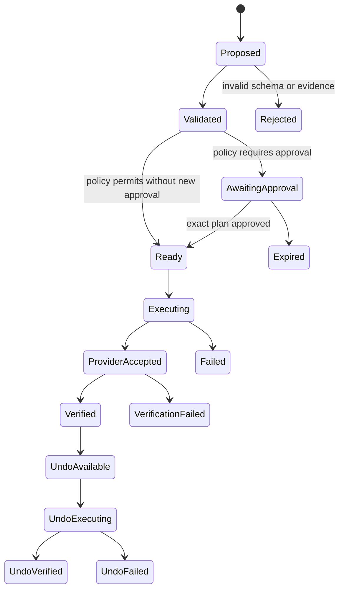

# Orbit Context Model

## Goals

The context model gives Orbit a consistent vocabulary without flattening provenance or inventing certainty. All identifiers are opaque, timestamps are ISO 8601 with timezone, and every externally derived fact retains its source and observed time.

## Core entities

| Entity | Purpose | Required properties |
|---|---|---|
| `Person` | A user or relevant individual | `id`, `displayName`, `relationshipScope` |
| `Household` | Explicit shared context boundary | `id`, `memberIds`, `policyRef` |
| `Relationship` | Directional relationship with visibility rules | `fromPersonId`, `toPersonId`, `type`, `visibility` |
| `SourceRecord` | Immutable provider provenance pointer | `id`, `provider`, `externalId`, `observedAt`, `contentHash` |
| `ContextEvent` | Normalized fact or change | `id`, `domain`, `kind`, `occurredAt`, `sourceRecordIds`, `payload` |
| `Evidence` | Support for an observation | `id`, `sourceRecordIds`, `summary`, `freshness`, `accessScope` |
| `Observation` | Validated claim about context | `id`, `statement`, `evidenceIds`, `confidence`, `status` |
| `Recommendation` | Suggested response to an observation | `id`, `observationIds`, `rationale`, `capabilityRef`, `status` |
| `Intent` | Structured user goal | `id`, `actorId`, `goal`, `constraints`, `createdAt` |
| `Capability` | Provider-neutral operation | `id`, `verb`, `resourceType`, `riskClass`, `adapterRequirements` |
| `Permission` | User-granted authority ceiling | `subjectId`, `capabilityId`, `scope`, `mode`, `expiresAt` |
| `ApprovalRequest` | Reviewable proposed consequence | `id`, `planHash`, `summary`, `riskClass`, `expiresAt` |
| `ActionPlan` | Immutable executable plan | `id`, `intentId`, `steps`, `expectedEffects`, `planHash` |
| `ActionResult` | Transport and provider response | `id`, `planId`, `state`, `providerReceipt`, `completedAt` |
| `VerificationResult` | Readback comparison | `id`, `actionResultId`, `expected`, `observed`, `status` |
| `UndoPlan` | Qualified compensating action | `id`, `actionResultId`, `steps`, `expiresAt`, `limitations` |
| `AuditEvent` | Redacted lifecycle event | `id`, `actor`, `eventType`, `objectRef`, `occurredAt`, `metadata` |

## Confidence and epistemic status

- `fact`: directly represented by one or more provider records.
- `derived`: deterministic transformation of facts.
- `inference`: model-assisted interpretation that remains fallible.
- `user_asserted`: supplied or corrected by the user.
- `verified_result`: confirmed through authoritative provider readback.

Confidence does not replace epistemic status. The interface should say “Orbit inferred” rather than visually presenting an inference as a source fact.

## Example observation

```json
{
  "id": "obs_fictional_travel_conflict",
  "statement": "Your flight is scheduled to land after the project review begins.",
  "epistemicStatus": "derived",
  "evidenceIds": ["ev_flight_arrival", "ev_calendar_review"],
  "confidence": 0.99,
  "freshness": { "asOf": "2026-07-16T08:15:00-04:00", "staleAfter": "2026-07-16T12:15:00-04:00" },
  "status": "active"
}
```

## Action lifecycle



## Data minimization

- Normalize only fields required for declared product purposes.
- Store provider payloads by reference when practical instead of duplicating them.
- Send the reasoning provider the smallest relevant context window.
- Redact sensitive payloads from audit metadata.
- Respect domain-specific retention and deletion rather than one global forever-memory setting.
- Do not infer household visibility merely because a source account is connected.

## Versioning

Schemas require explicit versions. Additive optional fields may remain compatible; changed meaning, permission semantics, or required fields require a new version and migration plan.
