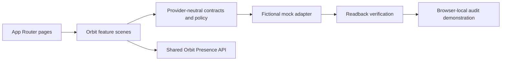

# Frontend Architecture

## Overview

Orbit uses Next.js App Router, React, and TypeScript. The first implementation is a production-quality mocked frontend: it demonstrates the product and trust model without real authentication, providers, persistence, voice services, or external execution.

## Boundaries

- `src/app`: route composition, metadata, global tokens, and administrative pages.
- `src/features/orbit`: the daily interaction state and scene components.
- `src/components/orbit-presence`: one variant-driven Presence component system.
- `src/domain/orbit`: provider-neutral types and deterministic execution policy.
- `src/mocks`: fictional records, the mock calendar adapter, and local demo history.

React components never receive Google-, Microsoft-, Home Assistant-, or OpenAI-specific response objects. Future adapters must translate provider records into the domain contracts first.

## Client and server decisions

The main daily shell is a client feature because the mocked conversation and action lifecycle are interactive. Static administrative route structure remains server-rendered; settings and history use small client islands for local preferences and undo. No Route Handler or Server Action is required in Stage 1.

Future OAuth callbacks, connector webhooks, and authenticated APIs may use route handlers, but those boundaries require a separate security and storage goal.

## Styling and motion

Global tokens define canvas, ink, accent, semantic state, focus, radii, and content widths. CSS Modules keep scene and Presence behavior colocated. Presence uses inline SVG because its paths are semantic state primitives specified by the product; motion is limited to transform, opacity, and stroke properties.

## Persistence

The selected Presence variant, demo preferences, and fictional audit record use `localStorage`. This is explicitly demonstration persistence, not an account or production data strategy.
