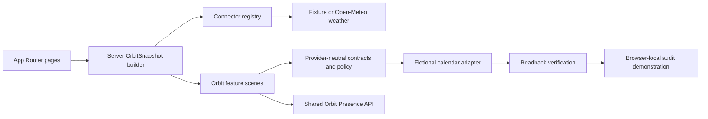

# Frontend Architecture

## Overview

Orbit uses Next.js App Router, React, and TypeScript. The scheduling and action journey remains a production-quality mock. Stage 2a adds one optional read-only provider: Open-Meteo weather for a fixed fictional coarse test location. The application still has no authentication, personal provider account, credential store, durable persistence, voice service, model call, or external execution.

## Boundaries

- `src/app`: route composition, metadata, global tokens, and administrative pages.
- `src/features/orbit`: the daily interaction state and scene components.
- `src/components/orbit-presence`: one variant-driven Presence component system.
- `src/domain/orbit`: provider-neutral types and deterministic execution policy.
- `src/mocks`: fictional records, the mock calendar adapter, and local demo history.
- `src/server/connectors`: server-only registry, configuration, fixture weather, and Open-Meteo transport and validation.
- `src/server/context`: assembles normalized provider data and existing fixtures into one versioned `OrbitSnapshot`.

React components never receive Google-, Microsoft-, Home Assistant-, or OpenAI-specific response objects. Future adapters must translate provider records into the domain contracts first.

## Client and server decisions

The main daily shell is a client feature because the conversation and mocked action lifecycle are interactive. The `/` server page first builds an `OrbitSnapshot` and passes it into that shell. `/connections` uses the same server builder so fixture/live mode, freshness, and health are consistent across routes.

`GET /api/orbit/snapshot` remains the normalized read boundary. Stage 2b adds
four narrowly scoped local Google Calendar lifecycle handlers for connect,
callback, bounded sync, and disconnect. OAuth exchange, refresh tokens, access
tokens, raw provider responses, and fixed provider URLs remain server-only.
The browser cannot choose a scope, calendar, callback, provider URL, or write
capability. Webhooks, hosted authenticated APIs, and write routes remain future
security goals.

`src/proxy.ts` is the single local network gate for pages, Route Handlers, and
RSC requests. It requires the raw Host to be the explicit IPv4 loopback plus a
bounded port, preventing DNS-rebinding origins from reaching personal context.
Snapshot-building reads only cached Calendar state; connector I/O occurs behind
the consent callback and exact-origin sync POST.

## Styling and motion

Global tokens define canvas, ink, accent, semantic state, focus, radii, and content widths. CSS Modules keep scene and Presence behavior colocated. Most Presence variants use semantic inline SVG with motion limited to transform, opacity, and stroke properties. The experimental Morph variant is a deliberate exception: it uses source-derived alpha WebP stills and state-specific frame loops to preserve liquid-metal material fidelity that SVG and lightweight procedural rendering could not reach. Morph remains isolated to the design experiment and is not the production default.

## Persistence

The selected Presence variant, demo preferences, and fictional audit record use `localStorage`. The weather connector uses only a process-memory 15-minute cache and does not persist raw provider responses. Neither mechanism is an account, background-sync, or production data strategy.
