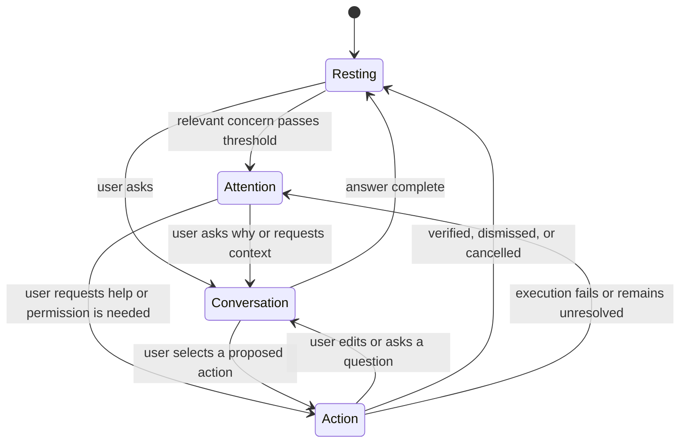

# Orbit Interaction Model

## Overview

Orbit has four primary daily states. These are experience states, not separate routes. The presentation shell changes composition while the underlying context, policy, action, verification, and audit models remain stable.

## 1. Resting state

The default state is nearly empty.

Visible elements may include:

- subtle Orbit mark
- current greeting or short contextual phrase
- voice and text input
- “Nothing needs your attention” when reassurance is useful
- one quiet ambient indication of listening or current context

No briefing list, domain summary, integration strip, metrics, or hidden-data preview appears.

## 2. Attention state

One concern enters focus because it is timely, consequential, unresolved, or requires permission.

The surface shows:

- one plain-language concern
- why it matters in one sentence
- freshness or uncertainty only when decision-relevant
- one natural next step
- a quiet statement that other concerns exist, when applicable

Supporting evidence remains collapsed. Secondary concerns never compete visually with the focal concern.

## 3. Conversation state

Conversation is navigation. The interface expands only enough to answer the active request.

Examples:

- “Why does that matter?” reveals the relevant evidence.
- “Show me the email” reveals the specific message, not the inbox.
- “What are my options?” reveals bounded alternatives.
- “Show my calendar” opens a temporary contextual calendar view.
- “What else?” moves the next eligible concern into focus.

Conversation may render text, a focused document, a small comparison, or a temporary domain tool. It does not become an accumulating chat transcript by default.

## 4. Action state

An action uses a focused sheet or scene containing only:

- proposed effect
- concise rationale
- decision-relevant evidence
- required permission or confirmation
- expected result
- approve and cancel
- verification outcome
- undo when verified and eligible

The approved plan is immutable. Changed recipients, content, timing, or effects require a new approval.

## Global structure

Daily use exposes Orbit/home and the conversation input. History and connections/settings remain reachable but visually quiet. Domains are accessed conversationally or contextually rather than through persistent top-level tabs.

## State continuity

- The same concern ID persists through attention, conversation, and action states.
- Collapsing or leaving the scene does not imply dismissal or approval.
- Resolved items move to history with their evidence, approvals, verification, and undo metadata.
- Returning to Resting means no current item meets the attention threshold; it does not mean Orbit forgot context.

## Accessibility

- State changes receive concise screen-reader announcements.
- Focus moves to newly revealed content only when the user initiated the disclosure.
- Keyboard users can reach input, evidence, approve, cancel, and history without traversing hidden domain controls.
- Listening and thinking states never rely on motion alone.
- Reduced-motion mode uses opacity and immediate state replacement rather than orbital movement.
